# Agent Loop

QueryArgus implements a **ReAct (Reason + Act)** loop: at each iteration the planner reasons about what it knows, picks a tool action, the system evaluates whether that action is acceptable, executes it, and feeds the result back into the next iteration's context.

---

## Loop Structure

```mermaid
flowchart TD
    Start([run&#40;connection, collection&#41;]) --> Boot

    Boot["Bootstrap\n- Load HistoricalContext\n- Initialise AgentState"]
    Boot --> Check

    Check{iteration < budget?}
    Check -- No --> Timeout

    Check -- Yes --> Propose
    Propose["Planner.propose&#40;state&#41;\nLLM → AgentAction"]

    Propose --> ActionGate
    ActionGate{"Action Gate\n&#40;rules / self / judge&#41;"}

    ActionGate -- FAIL --> InjectCritique["Inject critique\ninto state"]
    InjectCritique --> Increment
    ActionGate -- PASS/WARN --> Dispatch

    Dispatch{"Tool dispatch"}
    Dispatch -- schema_sample --> SchemaTool["schema_sample\n→ SchemaSampleResult"]
    Dispatch -- run_query --> QueryTool["run_query\n→ RunQueryResult"]
    Dispatch -- get_stats --> StatsTool["get_stats\n→ StatsResult"]
    Dispatch -- write_finding --> FindingGate

    SchemaTool & QueryTool & StatsTool --> UpdateState["Update AgentState"]
    UpdateState --> Increment

    FindingGate{"Finding Gate\n&#40;rules / self / composite&#41;"}
    FindingGate -- PASS --> Commit["Commit to state.findings"]
    FindingGate -- FAIL --> Dismiss["state.dismissed_findings"]
    Commit & Dismiss --> Increment

    Dispatch -- conclude --> RunGate
    RunGate{"Run Gate\n&#40;rules / self / judge&#41;"}
    RunGate -- PASS/WARN --> BuildReport
    RunGate -- FAIL + continue --> InjectRunCritique["Inject critique\ninto state"]
    InjectRunCritique --> Increment

    Increment["iteration += 1"] --> Check

    Timeout["Budget exhausted\n→ build partial report"]
    BuildReport["Build AuditReport\n- findings, trace\n- eval records\n- token usage\n- diff vs. previous run"]

    Timeout & BuildReport --> Persist["Persist to Postgres\n&#40;if configured&#41;"]
    Persist --> Output([Return AuditReport])
```



---

## Planner

**File:** `agent/planner.py`

The planner has one job: convert an `AgentState` into an `AgentAction`.

```python
class Planner:
    def propose(self, state: AgentState) -> AgentAction:
        user_prompt = render_user_prompt(state.summarize())
        response = self.llm.propose_action(system=SYSTEM_PROMPT, user=user_prompt)
        state.total_usage += response.usage
        state.usage_per_iteration.append(response.usage)
        return response.action
```

The LLM returns a structured `AgentAction`:

```python
class AgentAction(BaseModel):
    reasoning: str          # Why this action was chosen
    action: ActionName      # One of the five tool names or "conclude"
    action_input: dict      # Tool-specific parameters
    confidence: float       # 0.0–1.0 agent self-confidence
```

### System Prompt Responsibilities

The system prompt (`prompts.py`) establishes:

1. **Agent identity** — what QueryArgus is and what it must produce
2. **Tool catalogue** — name, purpose, and parameter shape for all four tools
3. **Phase ordering** — `schema_sample` MUST be first; `conclude` only after minimum investigation
4. **Calibration rules** — when to escalate severity, when NOT to write a finding
5. **Historical context usage** — how to interpret persistent vs. one-off patterns from prior runs

### User Prompt (State Summary)

The user prompt is built from `state.summarize()` — a compact, stable-shape snapshot (~500–1500 tokens):

| Section | Content |
|---------|---------|
| Run context | Collection name, iteration N/budget, documents sampled |
| Schema | Field paths, types, null rates, cardinality, sample values |
| Investigation status | Which fields have been investigated / concluded |
| Action history | Last 10 actions (deduped) |
| Findings so far | Committed findings with severity and affected count |
| Dismissed findings | What was rejected and why (prevents re-proposal) |
| Historical context | Persistent patterns, one-off patterns, dismissed patterns from prior runs |
| Last critique | Most recent evaluator feedback (from a FAIL verdict) |
| Token budget | Tokens used so far (to prevent runaway loops) |

---

## AgentState

**File:** `agent/state.py`

`AgentState` is the mutable loop record. It is passed to the planner and all evaluators at each iteration — it IS the agent's working memory for one run.

```python
@dataclass
class AgentState:
    # Identity
    collection: str
    database: str
    cosmos_account: str
    iteration_budget: int

    # Progress
    iteration: int = 0
    documents_sampled: int = 0
    collection_size: int = 0

    # Investigation results
    schema: SchemaSampleResult | None = None
    queries_run: list[dict] = field(default_factory=list)
    fields_investigated: set[str] = field(default_factory=set)
    fields_concluded: set[str] = field(default_factory=set)

    # Loop history
    history: list[AgentAction] = field(default_factory=list)
    last_observation: str | None = None
    last_critique: str | None = None   # ← injected by evaluator FAIL verdicts

    # Findings
    findings: FindingsCollector = field(default_factory=FindingsCollector)
    dismissed_findings: list[Finding] = field(default_factory=list)
    evaluation_records: list[EvaluationRecord] = field(default_factory=list)

    # Token tracking
    total_usage: TokenUsage = field(default_factory=TokenUsage)
    usage_per_iteration: list[TokenUsage] = field(default_factory=list)

    # Cross-run memory (loaded from Postgres at bootstrap)
    historical_context: HistoricalContext | None = None
```

### Critique Injection

When an evaluator returns `FAIL`, the loop injects the verdict's `critique` string into `state.last_critique`. The next call to `state.summarize()` includes it prominently, so the planner can course-correct without re-executing the failed action.

---

## Token Usage Tracking

Every LLM call (planner + evaluators) accumulates into `state.total_usage`:

```python
@dataclass(frozen=True)
class TokenUsage:
    input_tokens: int = 0
    output_tokens: int = 0

    @property
    def total_tokens(self) -> int:
        return self.input_tokens + self.output_tokens

    def __add__(self, other: TokenUsage) -> TokenUsage:
        return TokenUsage(
            input_tokens=self.input_tokens + other.input_tokens,
            output_tokens=self.output_tokens + other.output_tokens,
        )
```

The final `AuditReport` surfaces `total_input_tokens` and `total_output_tokens`, and the state summary includes running usage so the planner can decide to wrap up rather than spending the remaining budget on marginal investigations.

---

## Termination Conditions

| Condition | Outcome |
|-----------|---------|
| `conclude` action accepted by Run Gate | Normal exit → `AuditReport` |
| `iteration == iteration_budget` | Budget exhausted → partial `AuditReport` |
| `conclude` rejected, `run_fail_policy == "abort"` | Abort → raise `ArgusError` |
| Unrecoverable tool error | Abort → raise `ArgusError` |

---

## Key Properties

**No global state.** `AgentState` is scoped to one `agent.run()` call. Running two agents in parallel is safe.

**No external calls between iterations.** All LLM calls happen in `Planner.propose()` and the evaluators — the tool dispatch layer is pure Python + pymongo.

**The critique loop prevents infinite retry.** If the planner keeps proposing the same rejected action, the Rules evaluator's `no_repeat_query` rule will eventually FAIL it. The iteration counter always advances, so the loop terminates.
