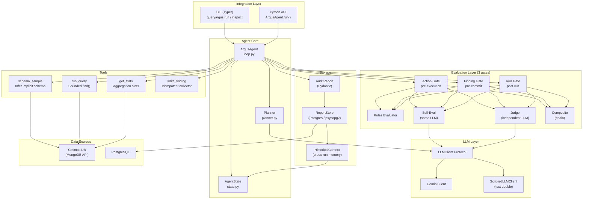

# Architecture Overview

QueryArgus is an autonomous data-quality agent built around a **ReAct planning loop** with a **three-gate evaluation layer**. This document covers the top-level component model, the data flow through a single run, and the key design decisions that shape the system.

---

## Component Map



---

## Package Layout

```
src/queryargus/
├── agent/
│   ├── loop.py          # ArgusAgent — orchestrates the ReAct loop
│   ├── planner.py       # Planner — state → prompt → AgentAction
│   ├── state.py         # AgentState — mutable per-run record
│   ├── prompts.py       # System prompt + user prompt templates
│   └── evaluation/
│       ├── base.py      # Evaluator protocols (ActionEvaluator, etc.)
│       ├── rules.py     # Deterministic rule lists
│       ├── self_eval.py # Same-LLM self-critique
│       ├── judge.py     # Independent judge LLM
│       ├── composite.py # Chain evaluators (fail-fast)
│       ├── factory.py   # Build evaluator stacks from EvaluatorConfig
│       ├── eval_prompts.py
│       └── llm_parse.py
├── tools/
│   ├── schema_sample.py
│   ├── run_query.py
│   ├── get_stats.py
│   └── write_finding.py
├── models/
│   ├── action.py        # AgentAction
│   ├── config.py        # ArgusConfig + EvaluatorConfig
│   ├── connection.py    # CosmosConnection
│   ├── evaluation.py    # EvaluationResult, EvaluationRecord
│   ├── finding.py       # Finding + FindingSeverity
│   ├── history.py       # HistoricalContext (cross-run memory)
│   └── report.py        # AuditReport
├── llm/
│   ├── client.py        # LLMClient Protocol + ScriptedLLMClient
│   └── gemini.py        # GeminiClient
├── storage/
│   ├── postgres.py      # ReportStore (raw psycopg2)
│   └── schema.sql
├── cli/
│   └── main.py          # Typer CLI
└── azure_service.py     # ARM / DefaultAzureCredential helpers
```

---

## Data Flow: Single Run

```
1. CLI / API call
   └─► ArgusAgent.run(connection, collection_name)

2. Bootstrap
   ├─► Load HistoricalContext from Postgres (if configured)
   └─► Initialise AgentState (iteration=0, empty findings)

3. ReAct Loop (repeat up to max_iterations)
   │
   ├─► Planner.propose(state)
   │       ├─ state.summarize() → compact prompt (~500–1500 tokens)
   │       └─ LLM → AgentAction (reasoning + action + confidence)
   │
   ├─► Action Gate (EvaluatorConfig.action)
   │       ├─ PASS → continue
   │       ├─ WARN → continue, record warning
   │       └─ FAIL → inject critique into state, retry (no tool call)
   │
   ├─► Tool Dispatch
   │       ├─ schema_sample → SchemaSampleResult → state.schema
   │       ├─ run_query     → RunQueryResult     → state.queries_run
   │       ├─ get_stats     → StatsResult        → state.queries_run
   │       └─ write_finding → Finding candidate
   │
   ├─► Finding Gate (if write_finding)
   │       ├─ PASS → Finding committed to state.findings
   │       └─ FAIL → Finding moved to state.dismissed_findings
   │
   └─► Run Gate (if action == conclude)
           ├─ PASS/WARN → build AuditReport, exit loop
           └─ FAIL (policy=continue) → inject critique, loop continues

4. Build AuditReport
   ├─ findings, dismissed_findings, evaluation_records, run_trace
   ├─ token usage per iteration
   └─ diff against previous run (new / resolved / regressed)

5. Persist (optional)
   └─► ReportStore.save(report) → Postgres

6. Output
   ├─ text → formatted stdout
   └─ json → AuditReport JSON
```

---

## Design Decisions

| Decision | Choice | Rationale |
|----------|--------|-----------|
| **Sync throughout** | `pymongo` sync, `psycopg2` sync | Matches QueryPal + QueryMCPal siblings; FastAPI callers use `run_in_threadpool` |
| **Raw psycopg2** | No SQLAlchemy ORM | Suite convention; simpler for v1; no migration framework overhead |
| **Pydantic v2** | All models | Native structured output for Gemini; schema validation free |
| **LLMClient Protocol** | `propose_action` + `complete_json` | Swap providers without touching the loop; enables `ScriptedLLMClient` test double |
| **Gemini-only in v1** | `gemini-2.5-flash` default | Cost-efficient; JSON schema output native; pluggable via Protocol for later |
| **3-gate evaluation** | Action / Finding / Run | Catch bad tool calls early (cheap); validate evidence before committing findings; audit overall coverage at the end |
| **Idempotent findings** | Keyed on `(field, category)` | Re-proposing the same finding updates in place; prevents duplicates across iterations |
| **src-layout** | `src/queryargus/` | Mirrors QueryMCPal; prevents accidental imports of uninstalled package |

---

## Further Reading

- [Agent Loop](agent-loop.md) — ReAct loop internals, planner, state summarisation
- [Evaluation Layer](evaluation.md) — Three gates, rule lists, composite chains
- [Memory & Persistence](memory.md) — Cross-run memory, HistoricalContext, ReportStore schema
- [Tools Reference](tools.md) — schema_sample, run_query, get_stats, write_finding
