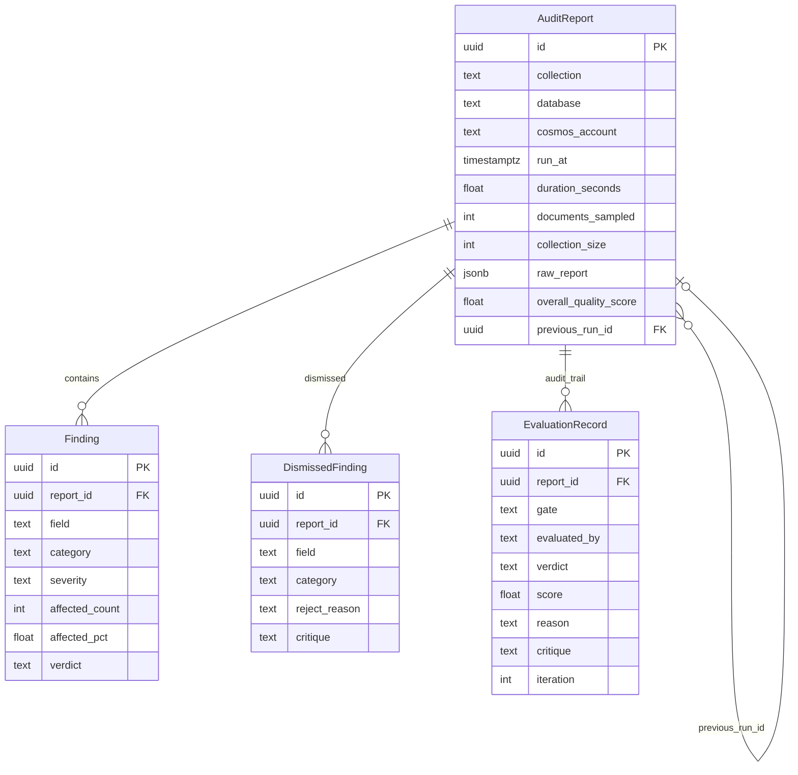

# Memory & Persistence

QueryArgus maintains two kinds of memory:

1. **Within-run memory** — `AgentState` carries the full investigation context for one run (schema, queries, findings, evaluation records, token usage, critiques).
2. **Cross-run memory** — `HistoricalContext` loaded from Postgres at the start of each run, giving the planner a view of findings that have persisted across multiple runs, findings that appeared only once, and patterns that were rejected by evaluators in the past.

---

## Cross-Run Memory Model



---

## HistoricalContext

**File:** `models/history.py`

Built by `ReportStore.get_historical_context()` from the last N runs for a given `(collection, database, cosmos_account)` triple.

```python
@dataclass(frozen=True)
class FindingHistory:
    field:               str
    category:            str
    runs_considered:     int
    runs_seen:           int          # How many of those runs had this finding
    severity_history:    list[str]    # Most-recent first
    affected_pct_history: list[float]
    last_seen_run_at:    datetime

    @property
    def is_persistent(self) -> bool:
        """Seen in 2+ of the last N runs."""
        return self.runs_seen >= 2

    @property
    def is_stable(self) -> bool:
        """affected_pct varies by < 15% across runs."""
        ...

@dataclass(frozen=True)
class DismissedPattern:
    """A (field, category) rejected by an evaluator in a prior run."""
    field:          str
    category:       str
    dismiss_reason: str
    critique:       str | None    # Suggested correction from the evaluator

@dataclass(frozen=True)
class HistoricalContext:
    runs_considered:   int
    last_run_at:       datetime | None
    finding_histories: list[FindingHistory]
    dismissed_patterns: list[DismissedPattern]

    @property
    def persistent_findings(self) -> list[FindingHistory]:
        return [h for h in self.finding_histories if h.is_persistent]

    @property
    def one_off_findings(self) -> list[FindingHistory]:
        return [h for h in self.finding_histories if not h.is_persistent]

    def render(self, *, max_findings: int = 40) -> str:
        """Compact text block for insertion into the planner's user prompt."""
        ...
```

---

## How Historical Context Shapes the Planner

The rendered `HistoricalContext` block appears in every user prompt, directly before the planner's task description:

```
=== Historical context (last 5 runs) ===

Persistent findings (seen in 2+ runs) — confirm they persist or are resolved:
  • users.age — null_rate — HIGH — 8.3% affected (stable)
  • orders.payment_method — type_mismatch — MEDIUM — 12.1% affected (worsening)

One-off findings (seen in 1 run only) — validate whether still present or noise:
  • sessions.device_id — outlier_value — LOW — 0.4% affected

Dismissed patterns (rejected by evaluator — do not re-propose without new evidence):
  • users.legacy_flag — null_rate — rejected: "affected_pct 0.001% below CRITICAL threshold"
    Suggestion: "downgrade to LOW or provide stronger evidence"
```

This enables three harness-engineering patterns:

| Pattern | How it works |
|---------|-------------|
| **Persistence confirmation** | Planner prioritises re-checking known issues before exploring new fields |
| **Noise filtering** | One-off findings from prior runs are flagged for re-validation rather than blindly re-reported |
| **Learning from rejection** | Dismissed patterns carry the evaluator's critique — the planner can correct its calibration before proposing the same finding again |

---

## ReportStore

**File:** `storage/postgres.py`

Raw `psycopg2` — no ORM, consistent with the QueryPal/QueryMCPal sibling suite.

### Key Methods

```python
class ReportStore:
    def __init__(self, dsn: str) -> None: ...

    def init_schema(self) -> None:
        """Apply idempotent CREATE TABLE IF NOT EXISTS from schema.sql."""

    def save(self, report: AuditReport) -> UUID:
        """Persist report + child rows in one transaction.
        Uses ON CONFLICT (id) DO UPDATE for safe re-runs."""

    def get(self, report_id: UUID) -> AuditReport | None:
        """Load full report by ID (deserialises from raw_report JSONB)."""

    def list_reports(
        self,
        *,
        collection: str | None = None,
        database: str | None = None,
        cosmos_account: str | None = None,
        limit: int = 50,
        offset: int = 0,
    ) -> list[ReportSummary]:
        """Lightweight rows for listings (avoids full deserialisation)."""

    def load_previous_run(
        self,
        collection: str,
        database: str,
        cosmos_account: str,
    ) -> AuditReport | None:
        """Most recent report for this collection — used for diff."""

    def get_historical_context(
        self,
        collection: str,
        database: str,
        cosmos_account: str,
        num_runs: int = 10,
    ) -> HistoricalContext:
        """Aggregate cross-run FindingHistory and DismissedPattern lists."""
```

### Schema

```sql
-- argus_reports: one row per run
CREATE TABLE IF NOT EXISTS argus_reports (
    id                  UUID PRIMARY KEY,
    collection          TEXT NOT NULL,
    database            TEXT NOT NULL,
    cosmos_account      TEXT NOT NULL,
    run_at              TIMESTAMPTZ NOT NULL,
    duration_seconds    FLOAT,
    documents_sampled   INT,
    collection_size     INT,
    overall_quality_score FLOAT,
    previous_run_id     UUID REFERENCES argus_reports(id),
    raw_report          JSONB NOT NULL    -- full AuditReport
);

-- Denormalised for UI filtering / analytics
CREATE TABLE IF NOT EXISTS argus_findings (
    id              UUID PRIMARY KEY,
    report_id       UUID NOT NULL REFERENCES argus_reports(id),
    field           TEXT NOT NULL,
    category        TEXT NOT NULL,
    severity        TEXT NOT NULL,
    affected_count  INT,
    affected_pct    FLOAT,
    verdict         TEXT
);

CREATE TABLE IF NOT EXISTS argus_dismissed_findings (
    id              UUID PRIMARY KEY,
    report_id       UUID NOT NULL REFERENCES argus_reports(id),
    field           TEXT NOT NULL,
    category        TEXT NOT NULL,
    reject_reason   TEXT,
    critique        TEXT
);

CREATE TABLE IF NOT EXISTS argus_evaluation_records (
    id              UUID PRIMARY KEY,
    report_id       UUID NOT NULL REFERENCES argus_reports(id),
    gate            TEXT NOT NULL,     -- 'action' | 'finding' | 'run'
    evaluated_by    TEXT NOT NULL,
    verdict         TEXT NOT NULL,
    score           FLOAT,
    reason          TEXT,
    critique        TEXT,
    iteration       INT
);
```

---

## AuditReport Diff

When Postgres is configured and a previous run exists, `ArgusAgent.run()` calls `AuditReport.diff_against(previous)` before returning:

```python
class AuditReport(BaseModel):
    ...
    previous_run_id:   UUID | None = None
    new_findings:      list[Finding] = []      # In this run, not in previous
    resolved_findings: list[Finding] = []      # In previous, not in this run
    regressed_fields:  list[str] = []          # Fields where severity worsened
```

The diff is keyed on `(field, category)` — the same idempotency key used by `FindingsCollector`. A resolved finding means its `(field, category)` pair is absent from the current run's findings.

---

## Storage Is Optional

When `--postgres-url` is not supplied:

- Historical context is not loaded — the planner operates without prior run context
- The run produces a fully valid `AuditReport` in memory
- The report is written to stdout (text or JSON) but not persisted

This makes QueryArgus usable as a zero-dependency CLI tool for one-off investigations.
